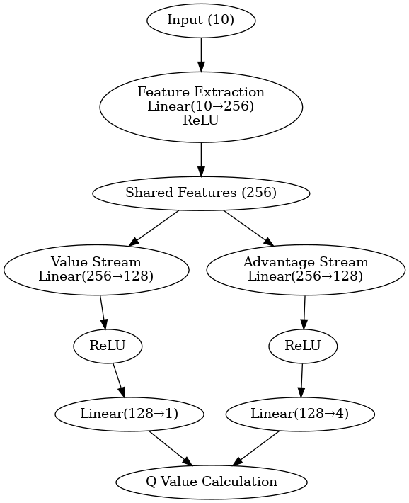
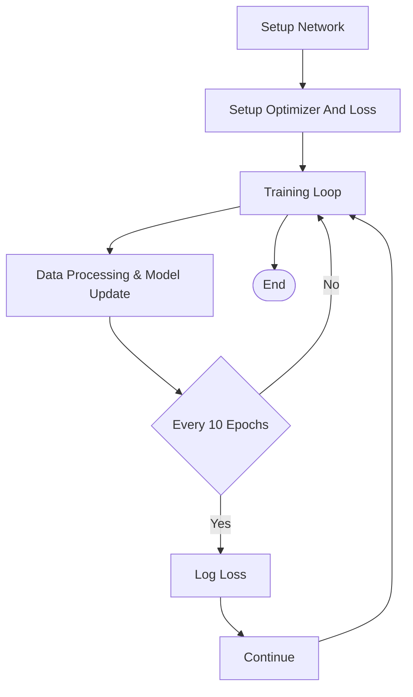
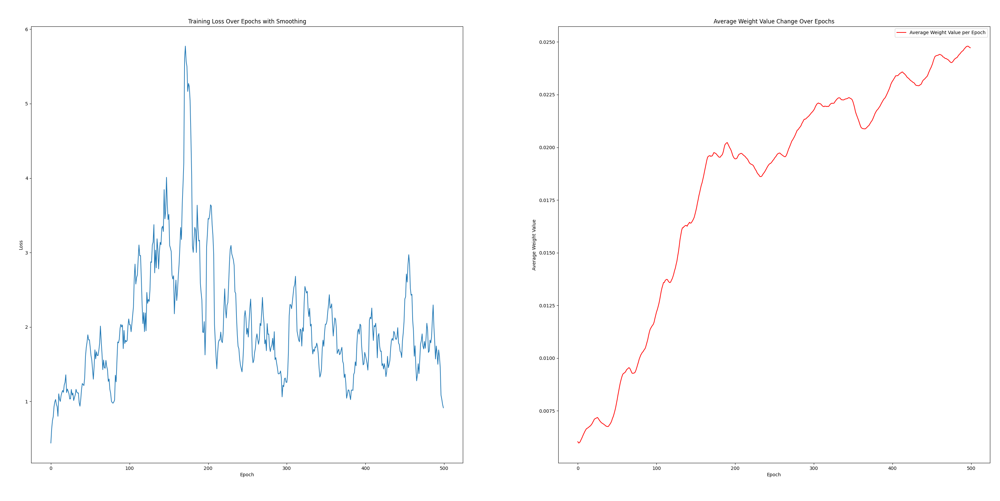

[TOC]

# Dueling Deep Q-Network Implementation Report

## Introduction

This report presents the implementation of a **Dueling Deep Q-Network (Dueling DQN)** using PyTorch. The Dueling DQN architecture enhances the traditional DQN by separately estimating the state-value and advantage functions, leading to more stable and efficient learning in reinforcement learning tasks.

## Tools and Libraries

The project leverages the following Python libraries:

- **PyTorch:** For building and training the neural network models.
- **Matplotlib:** For plotting training metrics and visualizations.
- **NumPy:** For numerical operations and data manipulation.
- **Graphviz:** For visualizing the computational graph of the neural network.

|---|

## Neural Network Architecture



## Neural Network Design

The neural network is structured as a Dueling Deep Q-Network (DuelingDQN), optimized for environments with discrete action spaces. The design consists of:

- **Feature Extractor**: Processes input states into a feature vector.

  - **Layers**: One fully-connected (FC) layer with 256 units followed by ReLU activation.

- **Value and Advantage Streams**: Separate pathways to estimate the overall state value and the advantages of individual actions.

  - **Value Stream**:
    - FC layer with 128 units + ReLU
    - FC output layer with 1 unit (state value)
  - **Advantage Stream**:
    - FC layer with 128 units + ReLU
    - FC output layer with action dimension units (advantages)

- **Output**: Combines the value and advantages to compute the Q-values for each action using the formula:
  - **Q-values** = Value + (Advantage - Mean(Advantage))

This design allows the network to learn which actions are more advantageous at any given state, improving decision-making and policy performance.

## Init, Optimizing And Training

The training process for the Dueling Deep Q-Network involves key steps, as illustrated in the flowchart below:

<center>
<div style="width:55%">



</div>
</center>

- **Key Steps Detailed**
  - **Network Setup**: Initialize a DuelingDQN model with specific state and action dimensions.
  - **Optimization and Loss Setup**: Use the Adam optimizer and Mean Squared Error loss function.
  - **Training Loop**: This includes generating data, computing Q-values, calculating targets and loss, and backpropagation.
  - **Logging**: Monitor training progress by logging the loss every 10 epochs.

|---|

## Visualization And Output

Two key aspects of the training process are visualized:

- **Loss Over Epochs**:

  - **Smoothing**: Apply a moving average to the loss values to smooth out fluctuations for clearer visualization.
  - **Plotting**: The smoothed losses are plotted against epochs to illustrate how the loss decreases over time.

- **Average Weight Value**:
  - **Weight Monitoring**: Calculate the average value of network weights after each epoch.
  - **Plotting**: The changes in the average weight value are plotted against epochs to monitor the stability and convergence of network weights during training.

Here is the log output while training:

```
model output : tensor([[-0.1189, -0.0271, -0.0614, -0.1267]],
grad_fn=<SubBackward0>)
Epoch 0: Loss = 0.35109788179397583
Epoch 10: Loss = 1.4051244258880615
...
Epoch 260: Loss = 1.0180060863494873
Epoch 270: Loss = 0.4133550226688385
```

Here is the output of training loss and average weight changes with epochs:


|---|

## Installation and Running

Follow these steps to set up the project on your local machine:

1. Platform

   - Ubuntu 20.04 LTS

2. Create and activate the conda environment

```py
conda env create -f environment.yml -n group_37
conda activate group_37
```

3. Run the code of our **Neural Networks**

```py
python3 ./main_Network.py
```

4. Remove The Env

```py
conda remove -n group_37 --all
```
